# Instagram clone
Целью данного курсового проекта является разработка клиент-серверного приложения, являющегося аналогом популярного приложения Instagram и имеющего аналогичный функционал. Приложение позволяет добавлять фото в личный аккаунт, просматаривать публикации других пользователей приложения. Есть возможность редактировать информацию в профиле, удалять публикации, смотреть профили других пользователей. 

Мобильное приложение разработано под ОС Android на языке Java. Сервер разработан на ASP.NET Core WEB Api. Для хранения пользовательских данных используется Реляционная база данных MS SQL Server.

Полный функционал приложения описан ниже:
- Создание пароля для входа в приложение;
- Регистрация пользователя;
- Ввод данных пользователя;
- Авторизация пользователя;
- Просмотр публикаций других пользователей;
- Просмотр профилей других пользователей;
- Осуществление доступ к директориям с фотографиями на устройстве;
- Получение уведомлений при успешной публикации;
- Добавление фото с описанием на сервер;
- Просмотр своего профиля;
- Редактирование своего профиля;
- Просмотр своей публикации;
- Удаление своей публикации.

Ниже продемонстрирован функционал приложения:

При запуске открывается экран-превью:

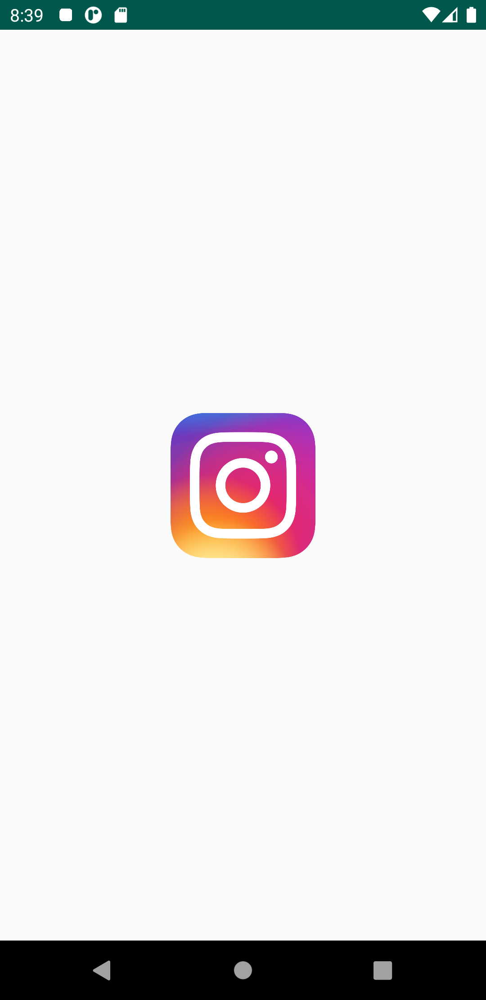
<br>

В случае первого запуска приложения предлагается создать пароль для входа в приложение, который будет использоваться при каждом запуске. В случае несовпадения паролей при подтверждении во время создания выводится сообщение об ошибке:

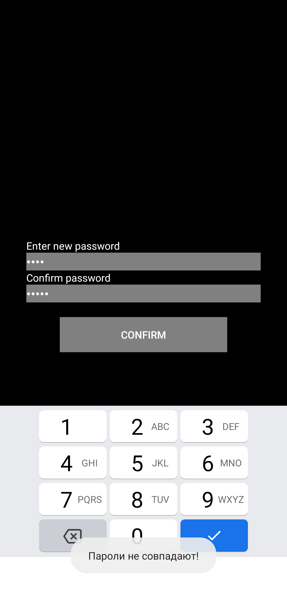
<br>

Следующая форма ввода пароля выводится при каждом входе в приложение. В случае ввода неверного пароля выводится ссответсвующее сообщение, иначе сообщается, что пароль введен верно и пользователь получает доступ к приложению:


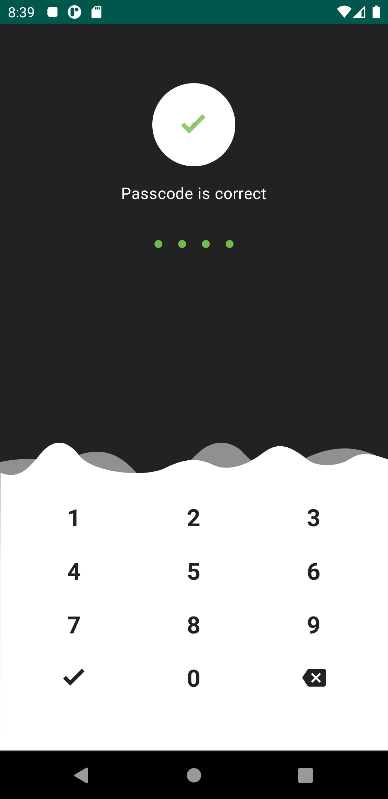
<br>

Открывается форма авторизации пользователя. <br>_На данном экране стоит запрет создания скриншотов во избежание случаев кражи авторизацмонных данных (на время тестирования запрет был отключен для демонстрации экрана). Также, здесь стоит обработчик нажатия кнопки "Назад" (onBackPressed), при срабатывании которого завершается сессия приложения._<br>
В случае, если у пользователя есть аккаунт, то он вводит авторизационные данные в соответствующие поля, иначе нужно нажать на голубую надпись под кнопкой входа для перехода на страницу Регистрации :

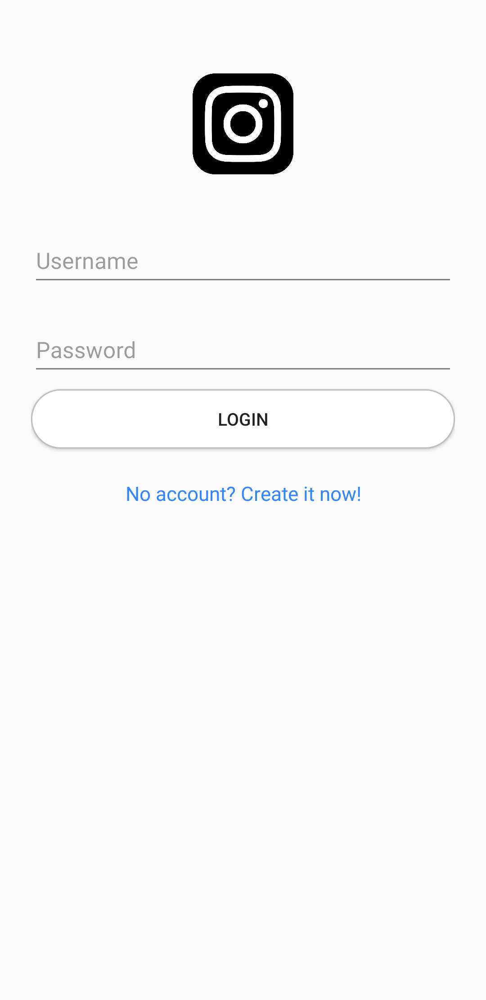
<br>

_На данном экране стоит запрет создания скриншотов во избежание случаев кражи авторизацмонных данных (на время тестирования запрет был отключен для демонстрации экрана)._<br>
Для регистрации необходимо ввести почту, придумать пароль и уникальное Имя пользователя, используемое в приложении. Сервер проверит, существует ли пользователь с таким именем и выведет соответствующее сообщение в случае совпадения имен. 

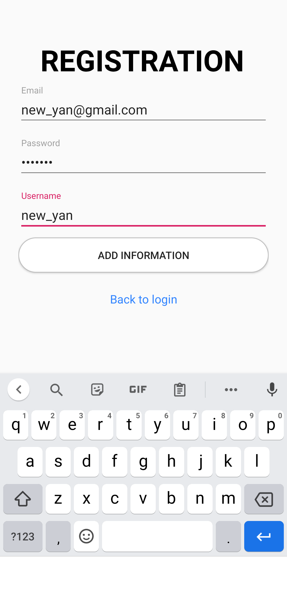
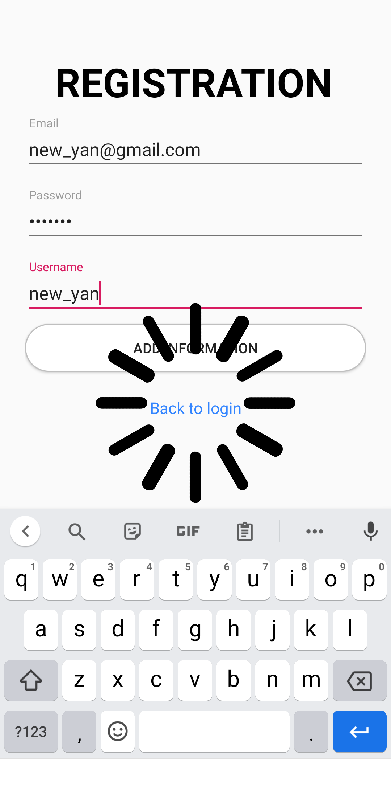
<br>

Далее пользователь переходит на страницу ввода личной информации. Вводить эти данные необязательно. После отправки регистрация считается успешной:

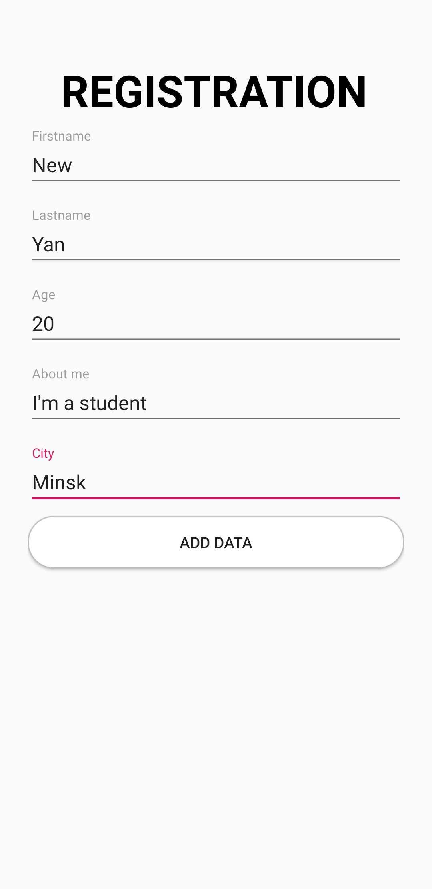
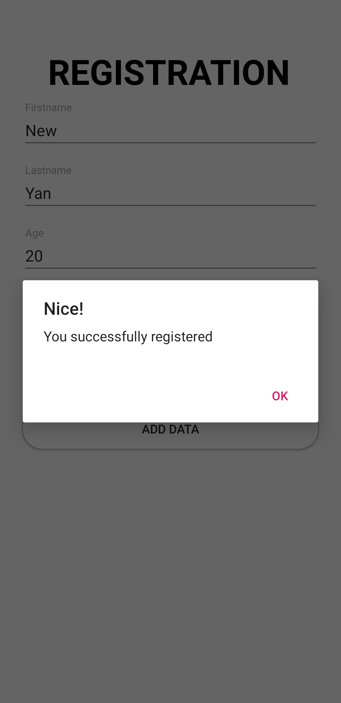
<br>

_На данном экране стоит обработчик нажатия кнопки "Назад" (onBackPressed), при срабатывании которого завершается сессия приложения._<br>
При входе в аккаунт пользователю отображается лента публикаций. Лента обновляется с помощью перетягивания вниз. После загрузки отображаются публикации пользователей:

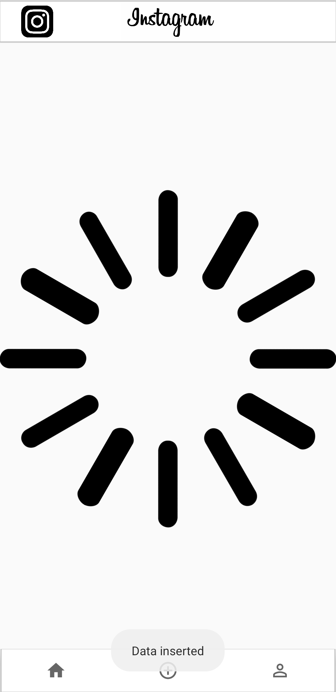
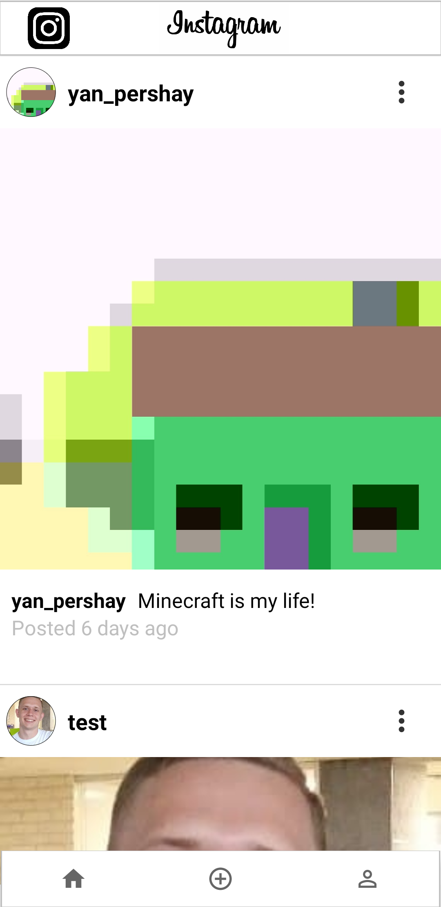
<br>

_На данном экране стоит запрет создания скриншотов во избежание случаев кражи снимков в галерее пользователя (на время тестирования запрет был отключен для демонстрации экрана)._<br>
Для добавления новой публикации необходимо нажать среднюю кнопку в нижнем меню. Откроется экран, отображающий изображения в каталогах устройства. На скриншотах отображены изображения в различных папках. Папки выбираются в выпадающем меню сверху экрана:

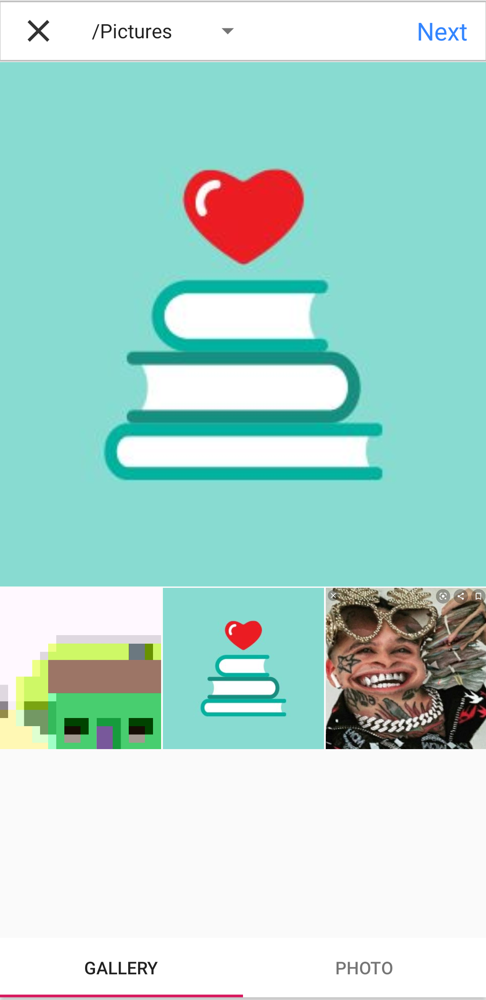
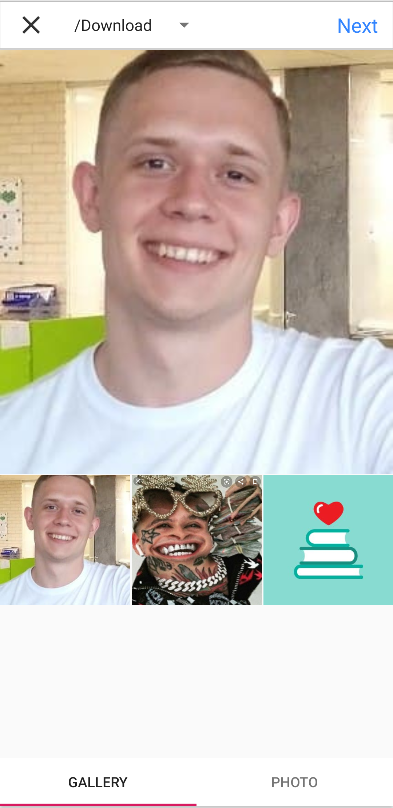
<br>

Также, имеется возможность загрузить фото непосредственно с камеры:

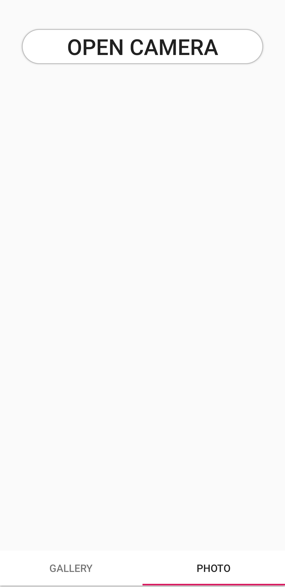
<br>

После выбора фото предоставляется возможность добавить описание к фото. После нажатия на кнопку "Share" в правом верхнем углу данные публикации отправляются на сервер:

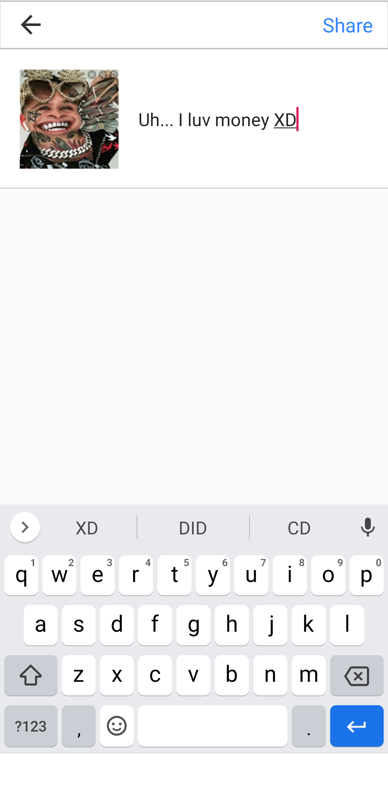
<br>

А пользователю приходит уведомление в случае успешной публикации. Ниже отображена обновленная лента публикаций:

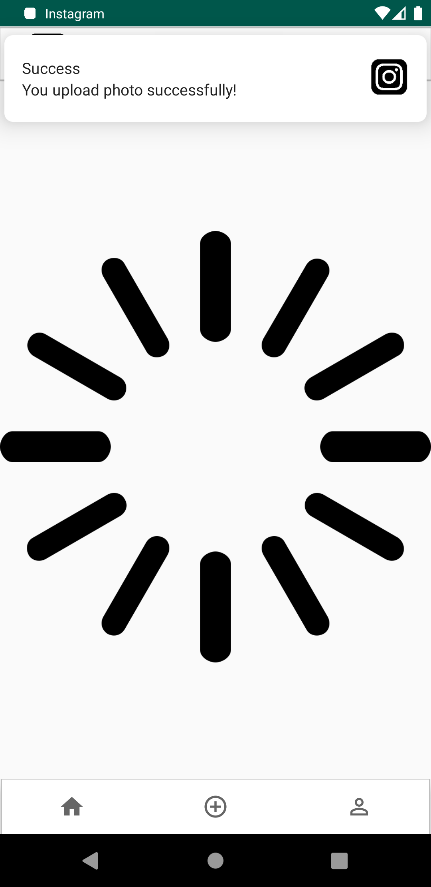

<br>

Пользователь имеет возможность посетить свой профиль. Там отображается его личная информация, публикации, их количество, а также имеет кнопка для редактирования профиля и выхода из профиля:

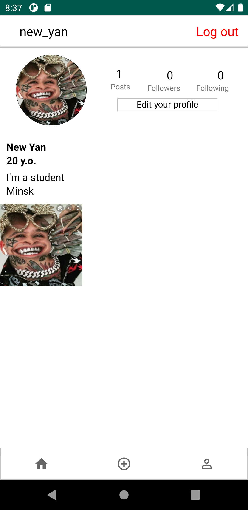
<br>

При нажатии на публикацию в профиле открывается экран с публикацией, позволяющий более детально рассмотреть фото, а также посмотреть описание фотографии.

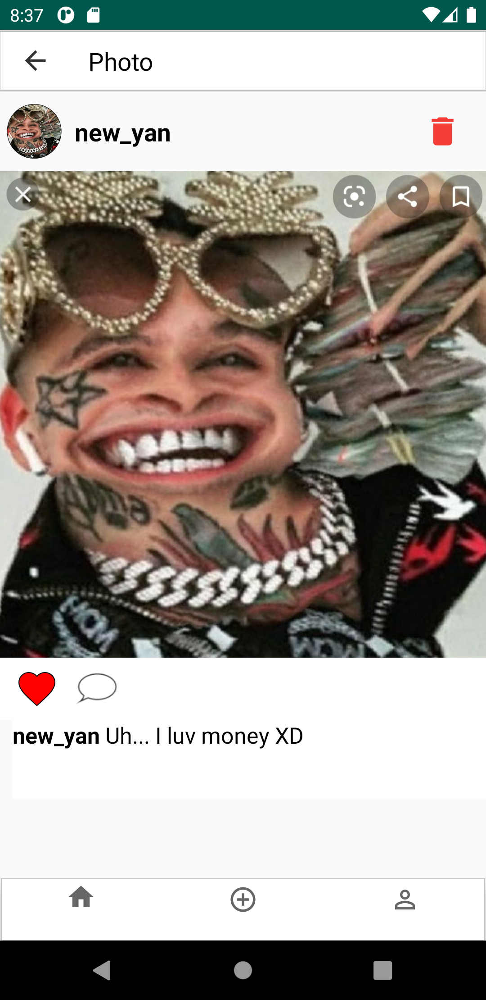
<br>

На экране публикации в правом верхнем углу имеется кнопка для удаления этой публикации. При нажатии на нее появляется диалоговое окно, требующее подтвердить удаление:


<br>

На данном скриншоте представлен профиль, не имеющий публикаций. При открытии такого профиля появляется диалоговое окно, предлагающее добавить фото:

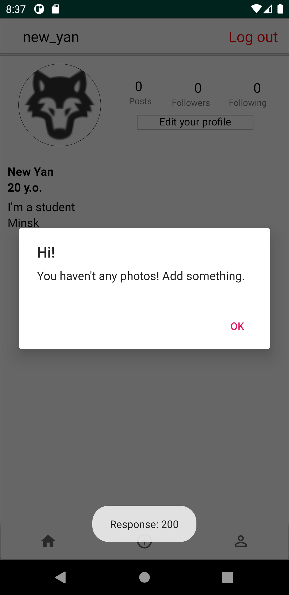
<br>

При переходе в окно редактирования профиля предоставляются текстовые поля с введенными нынешними данными. При изменении своих данных и сохранении данные пользователя обновятся:

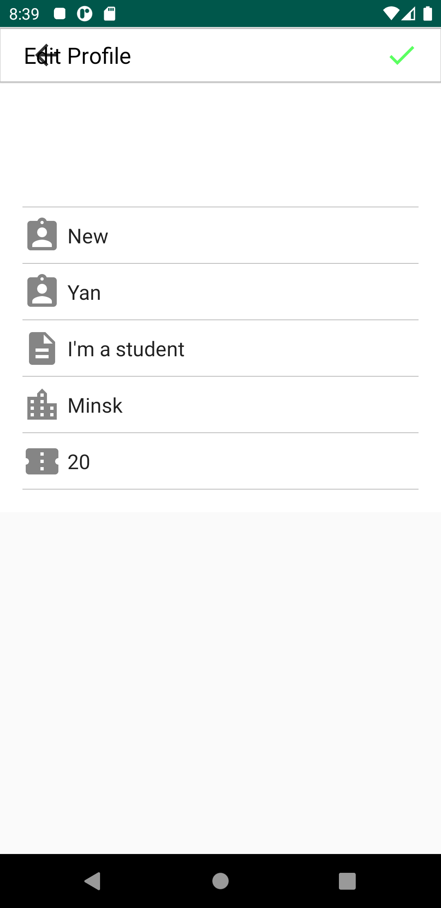
<br>

Также, из ленты можно попасть в профили других пользователей. Для этого нужно нажать на иконку профиля в публикации пользователя и откроется окно с профилем выбранного пользователя:

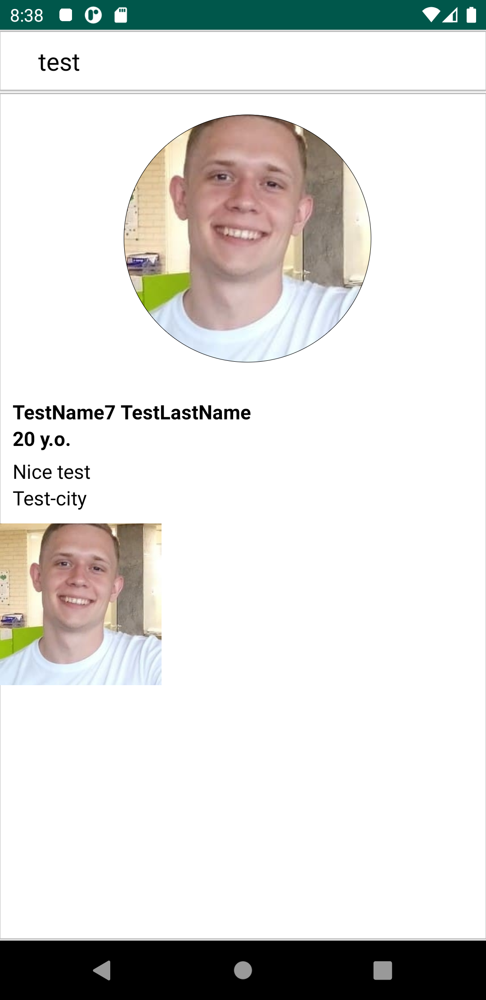
<br>

Пароли пользователей хранятся в базе данных в хешированном виде на базе алгоритма RFC2898:

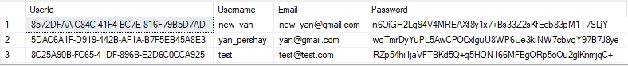
<br>

В проекте применена обфускация с использованием Proguard. Ниже представлены два скриншота. На первом отображено дерево проекта без обфускации, на втором, следовательно, после применения обфускации:
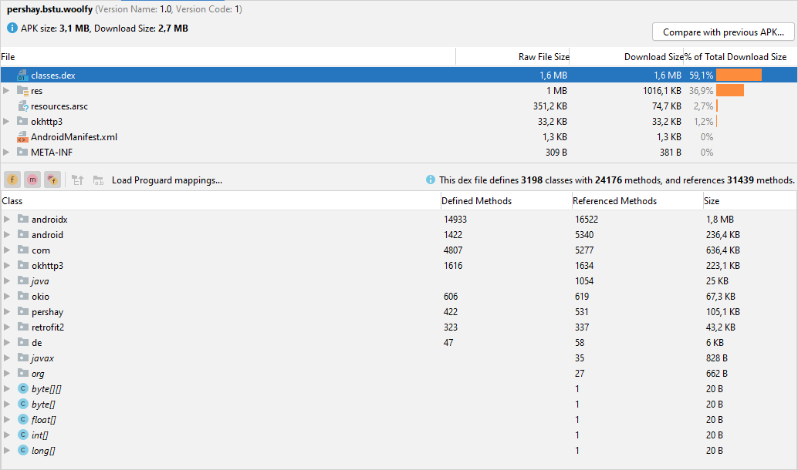

После обфускации наблюдается уменьшение объема памяти, занимаемой приложением, а также код приведен в нечитабельный вид, о чем говорит наличие папок с неоднозначными названиями:

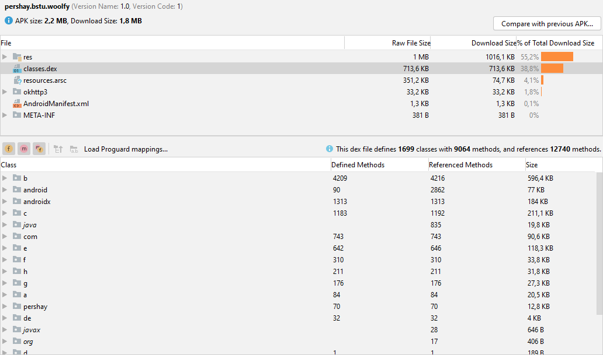


_Запрет создания скриншотов осуществляется путём размещения следующего кода в файле кода Activity:_

```getWindow().setFlags(LayoutParams.FLAG_SECURE, LayoutParams.FLAG_SECURE);```

_Использование функционала управления сессией приложения заключается в следующем:_
- _Определение, авторизован ли пользователь, и в зависимости от этого ему открывается либо экран авторизации, либо сразу новостная лента. Для этого используется SharedPreferences._
- _Завершение сессии приложения при нажатии кнопки "Назад"_

Реализованы следубщие требования:
- Регистрация пользователей
- Отправка изображений на сервер
- Добавление описания к публикации
- Авторизация при входе в приложение
- Отправка уведомлений

А также:
- Минимальное количество экранов 8+
- Защита приложения путем ввода пин-кода
- Использование защиты паролей при хранении в базе данных
- Управление сессией приложения
- Запрет создания скриншотов
- Обфускация

